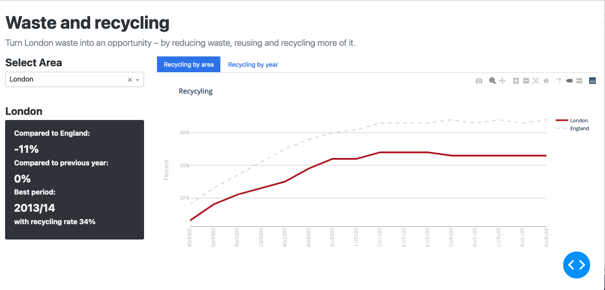
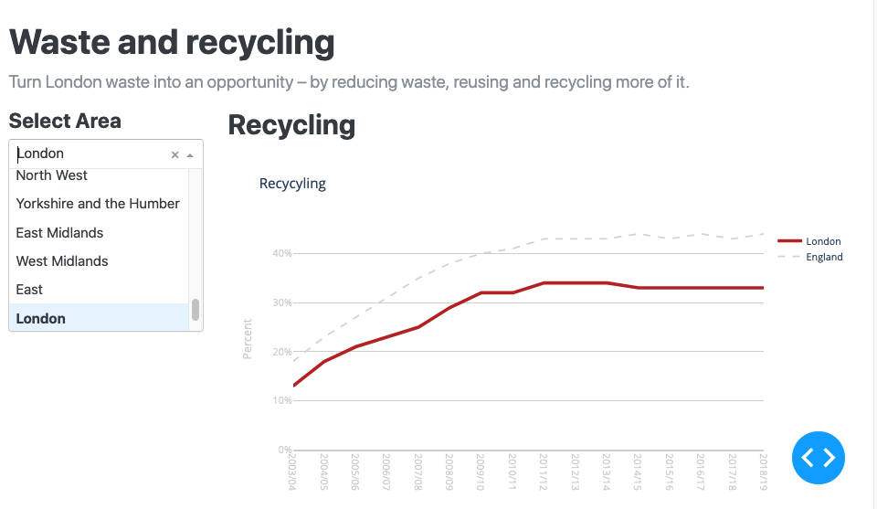

# Introduction to interactivity in Dash

## Introduction to this activity

So far in the course you have:

- Created the basic structure of a dash app (week 2)
- Used dash_html_components and dash_core_components to define a static layout in the app.layout (week 2)
- Used 3rd party CSS to style the dash app (week 2)
- Created charts using Plotly Express; and some using Plotly Go (week 3)
- Added the charts to a dash app (week 3)

In this activity we are going to look again at using Bootstrap to modify the app layout and use
more [Dash core components](https://dash.plotly.com/dash-core-components) and the callback function decorator for
achieving interaction.

This uses a simple household waste recycling app. The data is from the [London Datastore](https://data.london.gov.uk).
The charts mimic those displayed in the Environment section of the London Datastore website.

The directory structure of the app is:

```text
/recycle_app/
    recycle_app.py  # Creates the Dash app
    recyclingcharts.py  # Creates the recycling chart 
    recyclingdata.py  # Processes the recycling data and statistics
    /assets/  # Directory for css, images etc
    /data/ # Directory containing the datasets
```

You will need to refer to the [Dash documentation](https://dash.plotly.com/) as this guidance in this document alone
will be insufficient to complete the activities.

You can also call `help` in your Python console on any of the components to learn more about a component and its
available arguments e.g.:

```pycon
help(dcc.Dropdown)
```

## Run the Dash app

Have a look at `recycle_app.py` and then run it to see the current app.

## Modify the page structure using Bootstrap rows and columns

Currently, the Dash app has a single full width column layout.

In this activity you will modify the layout to look like this:



Hopefully you completed the css activities in week 2. If so you should be familiar with the grid layout that Bootstrap
supports.

One of the ways you can define the overall structure with Bootstrap is to divide the page into rows and columns.

Refer to
the [dash-bootstrap-components layout documentation](https://dash-bootstrap-components.opensource.faculty.ai/docs/components/layout/)
. The second section of the page ('Rows with columns'

### Modify the `app.layout` to add rows and columns

For our app we are going to have a layout with one row and one column for the page main heading, and one row with two
columns for the chart and a chart selector and statistics.

1. Add the code to `app.layout` below the current code e.g.

```python
app.layout = dbc.Container(fluid=True, children=[
    html.Br(),
    html.H1('Waste and recycling'),
    html.P('Turn London waste into an opportunity – by reducing waste, reusing and recycling more of it.',
           className='lead'),
    html.H2('Recycling'),
    dcc.Graph(id='recycle-chart', figure=fig_rc)


    # First row here
    dbc.Row(dbc.Col(html.P("A single column"))),
    # Second row here
    dbc.Row([
        # This is for the London area selector and the statistics panel.
        dbc.Col(width=3, children=[
            html.P('col 1')
        ]),
        # Add the second column here. This is for the figure.
        dbc.Col(width=9, children=[
            html.P('col 2')
        ]),
    ]),
])
```

When you save the changes to `recycle_app.py` your app should update in the browser. Make sure the app still runs.

2. Remove `html.P("A single column")` and move the H1 and the P below it into the first row.

3. Move `html.H2('Recycling')` and `dcc.Graph(id='recycle-chart', figure=fig_rc)` into the second column of the second
   row and remove the `html.P('col 2')` placeholder paragraph.

Run the app to check it looks correct.

## Add interactive elements to allow the charts to be changed and a stats summary card to be displayed

### Create a dropdown selector to allow the chart to be changed

Currently we see a chart comparing the average rate for all of England to the average rate for London. Let's add a drop
down selector to 'col1' allow us to choose a different area rather than London.

You will use the dash core components `dcc.Dropdown()` for this, however to understand its behaviour you need to
understand how an HTML `<select>` works so
read [an online HTML reference](https://developer.mozilla.org/en-US/docs/Web/HTML/Element/select) if you are not
familiar with this.

The code looks like this:

```python
html.H4("Select Area"),
dcc.Dropdown(id="area-select",
             options=[{"label": x, "value": x} for x in data.area_list],
             value="London"),
```

The list of areas in London to be used in the dropdown is contained in the `data` variable which is an instance of the
RecyclingData class (
see `recyclingdata.py`); and is accessed using `data.area_list`

1. Add the code above to the first column of the second row in your layout and remove `html.P('col 1')`.

Save your changes and the page should now look something like this:


2. Now add an html div that will later contain a Bootstrap card for the stats panel. Add it just below the area
   selector.

The code now looks like this:

```python
    dbc.Col(width=3, children=[
    html.H4("Select Area"),
    dcc.Dropdown(id="area-select",
                 options=[{"label": x, "value": x} for x in data.area_list],
                 value="London"),
    # Div that will later contain a bootstrap card format showing the stats.
    html.Br(),
    html.Div(id="stats-card")
]),
```

### Add a callback so that the statistics panel is displayed when an area is selected

While you can use the area selector dropdown, nothing happens when you select an area.

A **callback function** is a Python function that is automatically called by Dash whenever an input component's property
changes.

The basic structure of the callback is:

```python
@app.callback(Output(component_id='my-output', component_property='a_property'),
              [Input(component_id='my-input', component_property='another_property')]
              )
def update_output_div(input_value):
    return 'Output: {}'.format(input_value)
```

By writing this decorator, we're telling Dash to call this function whenever the value of the "input"
component (e.g. the dropdown) changes in order to update the children of the "output" component on the page (e.g. the
HTML div for the stats card).

You can use any name for the function that is wrapped by the `@app.callback` decorator. The convention is that the name
describes the callback output(s).

You can use any name for the function arguments, but you must use the same names inside the callback function as you do
in its definition, just like in a regular Python function. The arguments are positional: first the Input items and then
any State items are given in the same order as in the decorator.

You must use the same `id` you gave a Dash component in the `app.layout` when referring to it as either an input or
output of the `@app.callback` decorator.

The `@app.callback` decorator needs to be directly above the callback function declaration. If there is a blank line
between the decorator and the function definition, the callback registration will not be successful.

To create a callback:

- **Define the Input**. Identify the component id (e.g. id of an html element) and component property that the user will
  interact with.
- **Define the Outputs**. Identify the component id and property that will be updated after we make a change.
- **Write a Python function using the @callback decorator**. The function will be run when the Input has been selected.

1. Write code to update the statistics card when the area dropdown selection is changed.

- Import the classes for Input and Output from dash e.g. add to the import `from dash import dcc, Input, Output`.

- **Define the Input**: Look at the first column of the second row in the app layout. You should see the dropdown with
  an `id=area_select'` and the item that is selected from the list is the `value=`
  parameter. So, we can reference the country that is selected as `Input("area-select","value")`

- **Define the Outputs**: The last line of the first column in the app layout added a placeholder
  div: `html.Div(id="stats-card")`. We want to output a Bootstrap card with the statistics in and place it in this div,
  that is the card becomes the `children=` of the `html.Div(id="stats-card")`. So, we can reference the div as our
  output as `Output("stats-card","children")`.

- **Create the Callback function**: The function will take the area name selected in the dropdown and process the data
  for that area. The stats are calculated in `recyclingdata.py` and the resulting data is used to generate a bootstrap
  styled card with the statistical summary data. The HTML page is then updated by passing this 'card' to the div with
  the id of `stats-card`.

The code to do this is as follows. Copy and paste this into the end of `recycle_app.py` after the layout and then 'save'
to update the app.

```python
from dash import Output, Input


# Create the callbacks
@app.callback(Output("stats-card", "children"), [Input("area-select", "value")])
def render_output_panel(area_select):
    data.process_data_for_area(area_select)
    card = html.Div([
        dbc.Card(className="bg-dark text-light", children=[
            dbc.CardBody([
                html.H4(area_select, id="card-name", className="card-title"),
                html.Br(),
                html.H6("Compared to England:", className="card-title"),
                html.H4("{:,.0f}%".format(data.compare_to_eng), className="card-text text-light"),
                html.Br(),
                html.H6("Compared to previous year:".format(area=area), className="card-title"),
                html.H4("{:,.0f}%".format(data.change_area), className="card-text text-light"),
                html.Br(),
                html.H6("Best period:", className="card-title"),
                html.H4(data.best_period, className="card-text text-light"),
                html.H6("with recycling rate {:,.0f}%".format(data.best_rate), className="card-title text-light"),
                html.Br()
            ])
        ])
    ])
    return card
```

More information on the bootstrap card component
is [here](https://dash-bootstrap-components.opensource.faculty.ai/docs/components/card/).

More information on the bootstrap styles used in cards is [here](https://getbootstrap.com/docs/5.0/components/card/).

The summary stats card should now change as the area is changed using the dropdown.

### Add a callback to update the chart when the area selected changes

Create another callback.

Use the same Input as the previous callback i.e. the dropdown.

This time the Output is the `dcc.Graph(id='recycle-chart', figure=fig_rc)` component. The id is `recycle-chart` and the
parameter to be updated is the `figure=`.

The callback function should take the name of the area selected and pass it to the `create_chart` function to generate
the chart for that area of London.

Add the code below the previous callback you already added.

```python
@app.callback(Output("recycle-chart", "figure"), [Input("area-select", "value")])
def update_recycling_chart(area_select):
    fig_rc = rc.create_chart(area_select)
    return fig_rc
```

You have now gone from a static recycling chart to one that a user can interact with to explore the recycling in
different areas.

## Full code listing
The full code for the final `recycle_app.py` is:
```python
import dash
import dash_bootstrap_components as dbc
from dash import dcc, Output, Input
from dash import html

from recyclingdata import RecyclingData
from recyclingchart import RecyclingChart

# Prepare the data set
data = RecyclingData()
area = 'London'
data.process_data_for_area(area)

# Create the figures
rc = RecyclingChart(data)
fig_rc = rc.create_chart(area)

# Create a Dash app (using bootstrap).
app = dash.Dash(external_stylesheets=[dbc.themes.LUX])

# Create the app layout using Bootstrap fluid container
app.layout = dbc.Container(fluid=True, children=[
    dbc.Row(
        dbc.Col(children=[html.Br(),
                          html.H1('Waste and recycling'),
                          html.P(
                              'Turn London waste into an opportunity – by reducing waste, reusing and recycling '
                              'more of it.',
                              className='lead')
                          ]),
    ),
    dbc.Row([
        dbc.Col(width=3, children=[
            html.H4("Select Area"),
            dcc.Dropdown(id="area-select",
                         options=[{"label": x, "value": x} for x in data.area_list],
                         value="London"),
            html.Br(),
            html.Div(id="stats-card"),
        ]),
        dbc.Col(width=9, children=[
            html.H2('Recycling'),
            dcc.Graph(id='recycle-chart', figure=fig_rc),
        ]),
    ]),
])


# Create the callbacks
@app.callback(Output("stats-card", "children"), [Input("area-select", "value")])
def render_output_panel(area_select):
    data.process_data_for_area(area_select)
    card = html.Div([
        dbc.Card(className="bg-dark text-light", children=[
            dbc.CardBody([
                html.H4(area_select, id="card-name", className="card-title"),
                html.Br(),
                html.H6("Compared to England:", className="card-title"),
                html.H4("{:,.0f}%".format(data.compare_to_eng), className="card-text text-light"),
                html.Br(),
                html.H6("Compared to previous year:".format(area=area), className="card-title"),
                html.H4("{:,.0f}%".format(data.change_area), className="card-text text-light"),
                html.Br(),
                html.H6("Best period:", className="card-title"),
                html.H4(data.best_period, className="card-text text-light"),
                html.H6("with recycling rate {:,.0f}%".format(data.best_rate), className="card-title text-light"),
                html.Br()
            ])
        ])
    ])
    return card


@app.callback(Output("recycle-chart", "figure"), [Input("area-select", "value")])
def update_recycling_chart(area_select):
    fig_rc = rc.create_chart(area_select)
    return fig_rc


if __name__ == '__main__':
    app.run_server(debug=True)
```